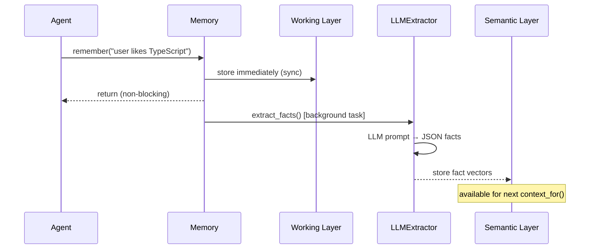

# LLMExtractor

AI-powered fact extraction. Runs as a background task — `remember()` is non-blocking.

## Supported providers

| Provider | Constructor | Model default |
|---|---|---|
| **Groq** (recommended) | `Memory.with_groq()` | `llama-3.1-8b-instant` |
| Anthropic | `Memory.with_anthropic()` | `claude-haiku-4-5-20251001` |
| OpenAI | `Memory.with_openai()` | `gpt-4o-mini` |
| Any OpenAI-compatible | `LLMExtractor(client, model=...)` | explicit |

## Groq (free tier, fastest)

```bash
# Get key at console.groq.com — no card required
pip install openai  # Groq uses OpenAI client
```

```python
from plyra_memory import Memory

memory = Memory.with_groq(
    api_key="gsk_...",
    agent_id="my-agent",
)

# Or with a different model
memory = Memory.with_groq(
    api_key="gsk_...",
    model="llama-3.3-70b-versatile",  # smarter, still fast
)
```

Via environment variable (server mode):

```bash
export GROQ_API_KEY=gsk_...
# Memory() auto-detects and uses Groq
```

## Anthropic

```bash
pip install anthropic
```

```python
memory = Memory.with_anthropic(api_key="sk-ant-...")
```

## OpenAI

```bash
pip install openai
```

```python
memory = Memory.with_openai(api_key="sk-...")
```

## How extraction works



## Extraction output

The LLM extracts structured facts in this format:

```json
{
  "facts": [
    {
      "subject": "user",
      "predicate": "PREFERS",
      "object": "TypeScript",
      "confidence": 0.95
    }
  ]
}
```

Predicates: `PREFERS`, `DISLIKES`, `IS`, `HAS`, `WORKS_AT`, `LIVES_IN`, `USES`, `KNOWS`

← [RegexExtractor](regex.md) · [Custom extractor](custom.md) →
