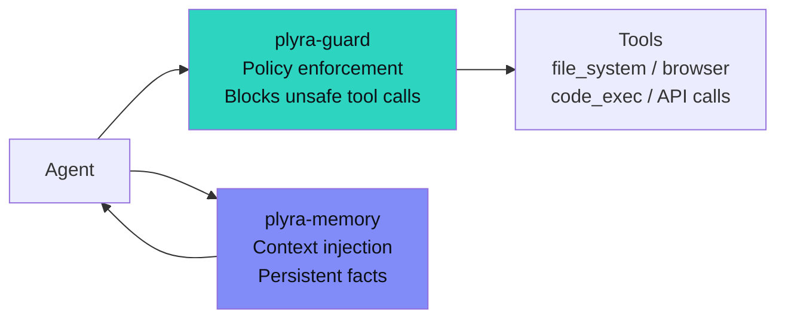
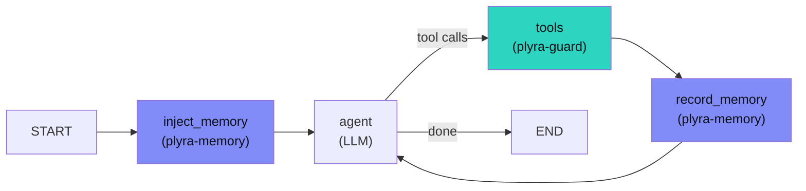

# plyra-guard + plyra-memory

Use guard and memory together for agents that are both safe and context-aware.

## What each does



- **plyra-guard** wraps tool calls — intercepts before execution, blocks by policy
- **plyra-memory** wraps the agent loop — injects context, stores observations

They operate at different levels and compose without conflict.

## Combined pattern

```python
import asyncio
from plyra_guard import Guard
from plyra_memory import Memory

# Guard policy
guard = Guard.from_yaml("policy.yaml")

# Memory — local or server mode
memory = Memory.with_groq(api_key="gsk_...", agent_id="safe-agent")

# Wrap tools with guard
@guard.wrap
async def search_web(query: str) -> str:
    ...

@guard.wrap
async def write_file(path: str, content: str) -> str:
    ...

# Agent loop with memory
async def run_agent(user_message: str):
    async with memory:
        # Inject memory context before each turn
        ctx = await memory.context_for(user_message, token_budget=512)

        # System prompt with memory context injected
        system = f"""You are a helpful assistant.

What you know about this user:
{ctx.content}
"""
        # Call LLM, get tool calls
        response = await call_llm(system, user_message)

        # Guard intercepts tool calls automatically via @guard.wrap
        # Blocked calls raise GuardException before execution
        for tool_call in response.tool_calls:
            result = await tool_call.execute()

        # Store the interaction in memory
        await memory.remember(
            f"User asked: {user_message}",
            source="user_message",
        )
        await memory.remember(
            f"Agent responded: {response.content[:200]}",
            source="agent_response",
        )
```

## LangGraph: guard + memory

LangGraph requires special handling for both. Guard needs `guarded_tool_node`. Memory needs `create_memory_nodes`.

```python
from langgraph.graph import StateGraph, MessagesState
from plyra_guard import Guard
from plyra_guard.integrations.langgraph import guarded_tool_node
from plyra_memory import Memory
from plyra_memory.adapters.langgraph import create_memory_nodes

guard = Guard.from_yaml("policy.yaml")
memory = Memory(agent_id="langgraph-agent")

# Memory nodes
memory_ctx_node, memory_rec_node = create_memory_nodes(memory)

# Guarded tool node
tools = [search_web, write_file, read_file]
tool_node = guarded_tool_node(tools, guard)

# Graph
graph = StateGraph(MessagesState)
graph.add_node("inject_memory", memory_ctx_node)   # reads memory → state
graph.add_node("agent", call_model)
graph.add_node("tools", tool_node)                 # guard-wrapped
graph.add_node("record_memory", memory_rec_node)   # writes to memory

graph.set_entry_point("inject_memory")
graph.add_edge("inject_memory", "agent")
graph.add_conditional_edges("agent", should_use_tools)
graph.add_edge("tools", "record_memory")
graph.add_edge("record_memory", "agent")
```



## Policy example

```yaml
# policy.yaml — guard policy used alongside memory
version: "1"
rules:
  - name: block-memory-file-tampering
    match:
      tool: write_file
      args:
        path:
          pattern: "~/.plyra/*"
    action: block
    reason: "Cannot modify memory store directly"

  - name: allow-safe-tools
    match:
      tool: "*"
    action: allow
```

## Installation

```bash
pip install plyra-guard plyra-memory
```

Both are independent — install only what you need. They share no internal dependencies.

← [Production checklist](guides/production.md) · [plyra-guard docs](https://plyraai.github.io/plyra-guard) →
