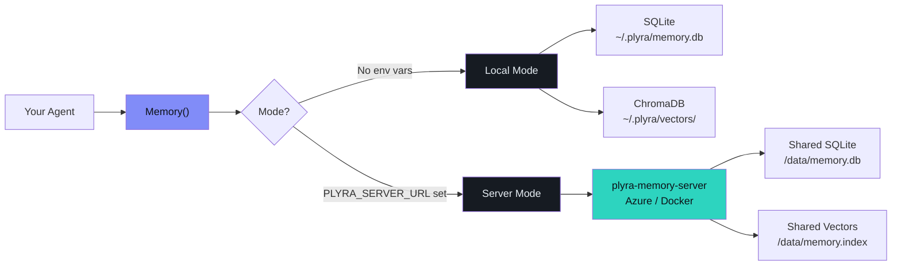
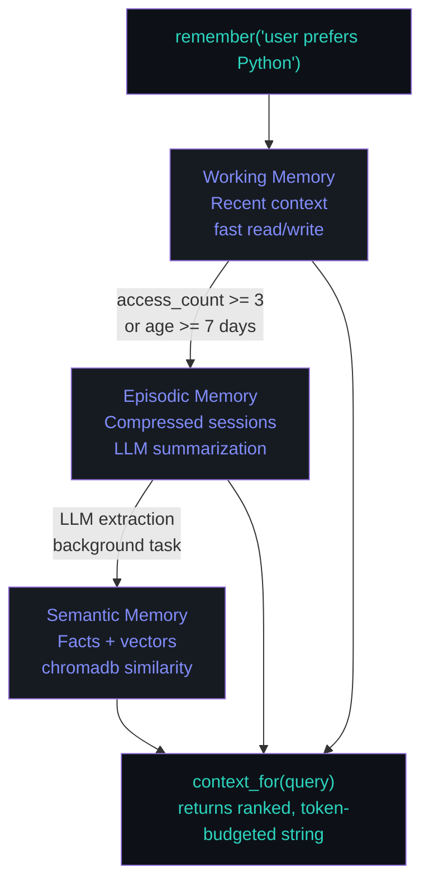

---
hide:
  - navigation
  - toc
---

<div class="plyra-hero">
  <h1>plyra-memory</h1>
  <p class="tagline">Persistent structured memory for AI agents.<br>
  Local-first. Server-optional. Framework-agnostic.</p>
</div>

```bash
pip install plyra-memory
```

```python
from plyra_memory import Memory

async with Memory(agent_id="my-agent") as memory:
    await memory.remember("user prefers TypeScript and hates verbose config")
    ctx = await memory.context_for("what stack does the user like?")
    print(ctx.content)
    # → "User prefers TypeScript. Dislikes verbose configuration."
```

<div class="plyra-grid">
  <div class="plyra-card">
    <h3>Three Memory Layers</h3>
    <p>Working → Episodic → Semantic. Automatic promotion. LLM-powered extraction.</p>
  </div>
  <div class="plyra-card">
    <h3>Framework-Agnostic</h3>
    <p>LangGraph, AutoGen, LangChain, CrewAI, OpenAI Agents, plain Python.</p>
  </div>
  <div class="plyra-card">
    <h3>Local-First</h3>
    <p>Zero config. SQLite + ChromaDB on disk. Add a server URL to go multi-agent.</p>
  </div>
  <div class="plyra-card">
    <h3>Production-Grade</h3>
    <p>Server mode with workspace isolation. Azure-ready Docker image.</p>
  </div>
</div>

## Architecture



## Three-Layer Memory Model



## Quick navigation

- New here? → [Quickstart](quickstart.md)
- How does it work? → [Concepts](concepts.md)
- Using LangGraph? → [LangGraph adapter](adapters/langgraph.md)
- Multiple agents? → [Server mode](server/index.md)
- Need guard + memory together? → [Guard integration](guard-integration.md)

---

[GitHub](https://github.com/plyraAI/plyra-memory) · [PyPI](https://pypi.org/project/plyra-memory) · [plyra-guard](https://plyraai.github.io/plyra-guard) · [@plyraAI](https://x.com/plyraAI)
