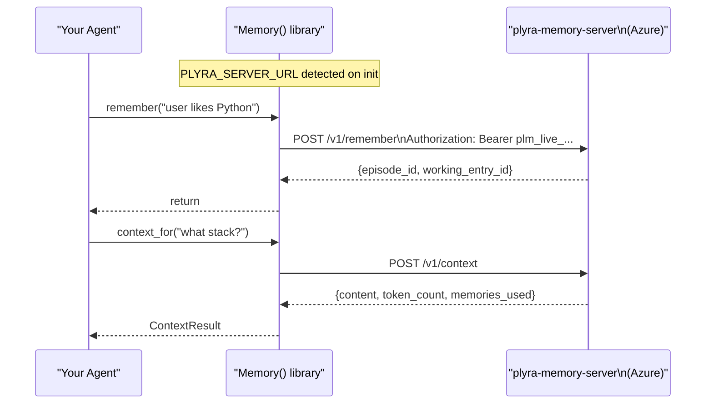

# Connect to plyra-memory-server

Connect the library to a running server in two environment variables.

## Get a free API key

Visit [plyra-keys.vercel.app](https://plyra-keys.vercel.app) — enter your email, get a key instantly. No account. No card.

## Set environment variables

```bash
export PLYRA_SERVER_URL=https://plyra-memory-server.politedesert-a99b9eaf.centralindia.azurecontainerapps.io
export PLYRA_API_KEY=plm_live_...
```

## Use Memory normally

Zero code changes from local mode:

```python
from plyra_memory import Memory

async with Memory(agent_id="my-agent") as memory:
    await memory.remember("this is stored on the server")
    ctx = await memory.context_for("what did I store?")
    print(ctx.content)
```

## How it works



## Workspace isolation

Your API key is tied to a workspace. Other workspaces cannot access your memory.

```
plm_live_your_key  → workspace: your-email-com
plm_live_other_key → workspace: other-email-com
                      ↑ completely separate, server-enforced
```

## Self-host

Want to run your own server?

→ [Docker quickstart](https://plyraai.github.io/plyra-memory-server/deploy/docker/)
→ [Azure deployment](azure.md)

← [Server overview](index.md) · [Azure deployment](azure.md) →
